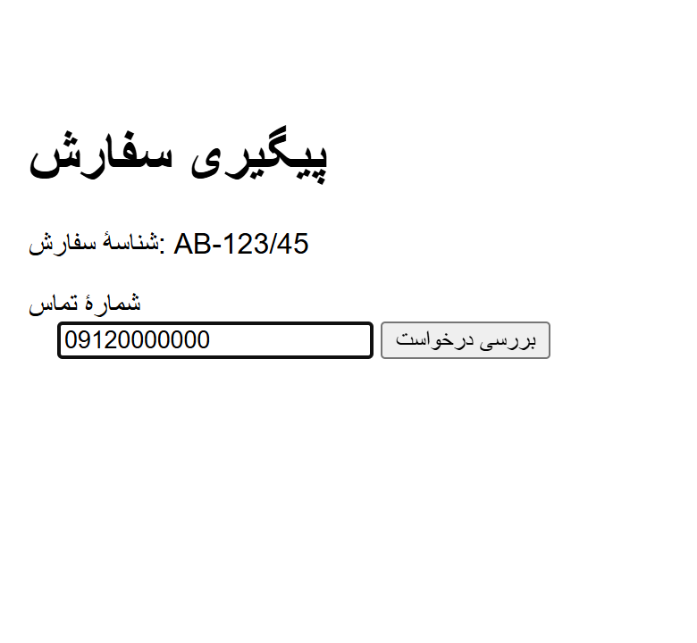
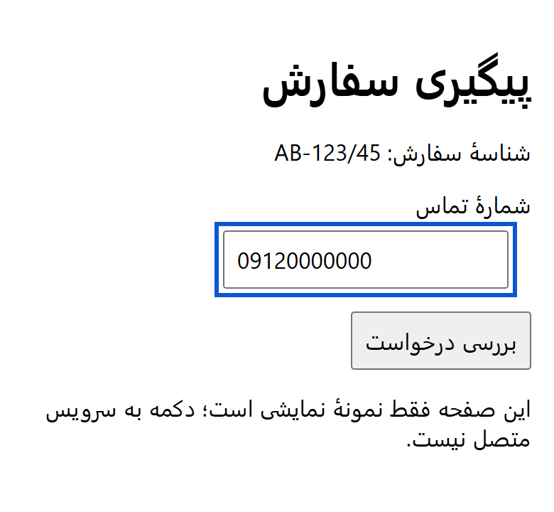

# اسکیل‌های بازار ایران و محصولات فارسی

**پنج اسکیل مستقل برای پژوهش بازار ایران، محتوای فارسی و رابط راست‌به‌چپ.**

[English](README.md) · [شروع سریع](#شروع-سریع) · [قبل و بعد](#قبل-و-بعد) · [راهنماها](docs/README.md) · [مجوز MIT](LICENSE)


به ایجنتت یک کار مشخص، اطلاعات مرتبط و معیار پایان کار بده. خروجی می‌تونه تصمیم پژوهشی، مقایسهٔ محصول، بررسی رابط فارسی، مقالهٔ کاربردی یا برنامهٔ بهبود سئو باشه؛ با شواهد و ابهام‌های روشن.

**برای توسعه‌دهنده‌ها، تیم‌های محصول، پژوهشگرها و نویسنده‌ها.** زبان فارسی و جغرافیای ایران دو ورودی جدا هستن؛ مخاطب و لحن هر پروژه رو بریف خودش تعیین می‌کنه.

## شروع سریع

با Node.js و Git نصب‌شده، هر پنج اسکیل رو از طریق [Skills CLI](https://github.com/vercel-labs/skills) نصب کن:

```bash
npx skills@latest add sajadjanat/iran-market-skills --skill '*'
```

ابزارت رو در نصب‌کننده انتخاب کن؛ یا `--agent codex`، `--agent claude-code` یا `--agent cursor` رو به دستور اضافه کن. نسخهٔ موردنیاز CLI رو بررسی کن و اگر لازم شد، برای شناسایی اسکیل‌ها یک تسک تازه باز کن.

بعد، به اسکیل منتخب ورودی واقعی بده:

```text
با $persian-brand-copy یه مقالهٔ کاربردی فارسی بنویس.
متن‌های تأییدشدهٔ پیوست رو بخون و لحن محاوره‌ای‌شون رو حفظ کن.
یک فعالیت مشخص معرفی کن، وسایلش رو بگو و یه دور کامل رو مثال بزن.
آخرش چیزی به خواننده بده که بتونه امتحانش کنه.
اطلاعات واقعی رو بررسی کن و مثال فرضی رو مشخص کن. فعلاً فقط پیش‌نویس بده.
```

برای بررسی فرم، از `$persian-rtl-ux` با [کد دموی نمونه](examples/rtl/before.html) استفاده کن. ویرایش کوچک هم می‌تونه در همون محدودهٔ کوچک بمونه.

<details>
<summary>نصب تکی، دیدن فهرست یا استفاده در Claude وب و دسکتاپ</summary>

```bash
npx skills@latest add sajadjanat/iran-market-skills --list
npx skills@latest add sajadjanat/iran-market-skills --skill persian-rtl-ux --agent codex
```

برای Claude وب و دسکتاپ، از همین نسخهٔ محلی ZIP مستقل بساز:

```bash
python scripts/package_skills.py
```

فایل مرتبط `dist/<skill-name>.zip` رو بارگذاری کن؛ ZIP کل ریپو یا بستهٔ بیرونی مجموعه، یک اسکیل نیست. دسترسی حساب، بارگذاری و اجرای Claude هنوز اینجا تأیید نشده. [راهنمای نصب](docs/installation.md) روش دستی، ویندوز و ابزارهای دیگر رو توضیح می‌ده. [دانلودهای میزبانی‌شده](https://sepehra.ir/skills/#install) وضعیت انتشار جدا دارن؛ آپدیت سورس به‌تنهایی اون ZIPها رو آپدیت نمی‌کنه.

</details>

## کدوم اسکیل به کارت میاد؟

| کاری که می‌خوای انجام بدی | اسکیل | خروجی کاربردی |
|---|---|---|
| انتخاب نیاز مشتری برای بررسی | [iran-market-discovery](docs/iran-market-discovery.md) | شواهد، پیشنهاد محدود و آزمایش بعدی |
| مقایسهٔ محصول یا تجربهٔ محتوایی ایرانی | [iran-product-benchmark](docs/iran-product-benchmark.md) | مشاهدهٔ تاریخ‌دار، مقایسهٔ انتخاب‌ها و اقتباس اصیل |
| اصلاح فرم، متن ترکیبی یا صفحهٔ مطالعه | [persian-rtl-ux](docs/persian-rtl-ux.md) | ایراد با محل مشخص، اصلاح محدود و وضعیت واقعی آزمون |
| نوشتن متن برند، مقالهٔ کاربردی یا آموزش | [persian-brand-copy](docs/persian-brand-copy.md) | متن پیوسته با لحن تأییدشده و اطلاعات بررسی‌شده |
| بهبود صفحات یا انتخاب محتوای تازه | [persian-seo](docs/persian-seo.md) | اولویت صفحه‌محور، نتیجه برای خواننده و برنامهٔ سنجش |

یکی رو انتخاب کن یا خروجی‌هاشون رو متناسب با کار کنار هم بذار. هر بسته مراجع، سیاست شواهد و مجوز خودش رو داره؛ نصب اسکیل یا پلاگین دیگری لازم نیست.

## قبل و بعد

### فرم فارسی: جهت متن، شناسه و فوکوس

این‌ها اسکرین‌شات واقعی از **دموی ساختگی همین ریپو** هستن؛ گرفته‌شده در ۸ اکتبر ۲۰۲۶ با Edge بدون پنجره، در اندازهٔ یکسان ۳۹۰ × ۳۶۰ و با مقدار ورودی و وضعیت فوکوس یکسان. فرم به بک‌اند وصل نیست.

<table>
<tr><th>قبل</th><th>بعد</th></tr>
<tr>
<td></td>
<td></td>
</tr>
</table>

| تغییر | دلیل کاربردی |
|---|---|
| `lang="fa"` و `dir="rtl"` | مشخص‌شدن زبان فارسی و جهت مطالعه |
| جداسازی جهت شناسهٔ لاتین | خواناماندن `AB-123/45` بدون تغییر مقدار |
| اتصال برچسب و نمایش فوکوس | نام قابل تشخیص برای فیلد و مشخص‌بودن محل فوکوس |
| فاصله‌گذاری منطقی و شکستن خط | چیدمان مناسب در عرض باریک |

[کد قبل](examples/rtl/before.html)، [کد بعد](examples/rtl/after.html)، [جزئیات ثبت تصویر](docs/assets/readme/capture.json) و [آزمون قبلی کیبورد و مرورگر](evals/results/review-2026-10-03.md) رو ببین. ظاهر صفحه به‌تنهایی رفتار صفحه‌خوان، کیبورد موبایل، کلیپ‌بورد یا بک‌اند رو ثابت نمی‌کنه.

### یک ایدهٔ کاربردی: از توصیهٔ مبهم تا فعالیت قابل اجرا

این بازنویسی یک مثال تألیفی است؛ آزمایش کنترل‌شده با اسکیل و بدون اسکیل نیست:

| متن مبهم | بازنویسی کاربردی برای بریف محاوره‌ای |
|---|---|
| «با یک فعالیت خلاقانه، لحظاتی فراموش‌نشدنی برای دوستان خود رقم بزنید.» | «یه کاغذ بذار وسط و از هر نفر بخواه یه خط به نقاشی اضافه کنه. نفر بعد باید همون شکل رو ادامه بده؛ بعد از یه دور، ببینید هر کدومتون فکر می‌کردید دارید چی می‌کشید.» |

نسخهٔ دوم یک فعالیت و قدم بعدی معرفی می‌کنه. مقالهٔ کامل به آماده‌سازی، دور نمونه و پایان روشن هم نیاز داره. بریف رسمی، متن رسمی می‌گیره. [روش نگارش مقاله](skills/persian-brand-copy/references/articles.md)، [خروجی کامل یک ارزیابی](evals/results/editorial-2026-10-08/copy-practical-article.md) و [درس‌های محتوایی فارسی](docs/editorial-lessons.fa.md) رو ببین.

## زمینهٔ محلی کجا به کار میاد؟

جزئیاتی که نتیجهٔ کار رو عوض می‌کنن بررسی می‌شن: ریال و تومان و مبلغ نهایی، وضعیت پرداخت، قرارداد ورودی ارقام و موبایل، تقویم و منطقهٔ زمانی انتخاب‌شده، پوشش واقعی خدمت، متن ترکیبی و نیت جست‌وجوی فارسی. [نقشهٔ موضوعات](docs/iran-context.fa.md) محدوده رو توضیح می‌ده.

در محتوا، لحن تأییدشده حفظ می‌شه، مثال عملی به متن شکل می‌ده و شرایط مخاطب بررسی می‌شه. سلیقهٔ یک مالک یا چند نتیجهٔ سرچ فارسی، شاهد علاقهٔ همهٔ ایرانی‌ها نیست. دادهٔ موجود پروژه هم پیش از درخواست دسترسی اضافه بررسی می‌شه.

## شواهد و وضعیت فعلی

| گزارش | چه چیزی رو نشان می‌ده؟ |
|---|---|
| [ارزیابی محتوا · ۸ اکتبر ۲۰۲۶](evals/results/editorial-2026-10-08/review.md) | پنج نشست مستقل؛ ۲۰ معیار پاس‌شده با ورودی ساختگی |
| [قراردادهای کاربردی · ۴ اکتبر ۲۰۲۶](evals/results/iran-contracts-2026-10-04/review.md) | پنج سناریو؛ ۲۱ معیار پاس‌شده با دادهٔ ساختگی |
| [زمینهٔ محلی · ۳ اکتبر ۲۰۲۶](evals/results/iran-context-2026-10-03/review.md) | پنج سناریو؛ ۲۲ معیار پاس‌شده با ورودی ساختگی |
| [بررسی منابع](research/source-review-2026-10-03.md) | وضعیت تاریخ‌دار دسترسی، شامل منابع غیرقابل خواندن |

این‌ها بررسی‌های محدودن؛ آزمون با خواننده، تضمین رتبه یا شاهد افزایش فروش نیستن. دسترسی ابزار و اطلاعات روز هر کار همچنان باید بررسی بشه. [سیاست داده](DATA-POLICY.md) مشاهده، دادهٔ کاربر، برداشت و فرضیه رو جدا نگه می‌داره. [سنجش با کاربران واقعی](docs/user-validation.fa.md) هنوز یک روش پیشنهادی است، نه پژوهش انجام‌شده.

**وضعیت انتشار:** نسخهٔ `0.2.0` در [CHANGELOG.md](CHANGELOG.md) هنوز Unreleased است. نصب از سورس، انتشار ZIP میزبانی‌شده و حضور در مارکت‌پلیس جدا هستن. قالب [Agent Skills](https://agentskills.io/specification) و اطلاعات نمایش Codex به شناسایی کمک می‌کنن؛ شناسایی به‌تنهایی اجرای موفق در همهٔ ایجنت‌ها رو ثابت نمی‌کنه. [بارگذاری در حساب Claude](evals/results/claude-account-check-2026-10-04.md) هنوز تأیید نشده.

## توسعه و مشارکت

```bash
python -m pip install -r requirements-dev.txt
python scripts/validate_repo.py
python -m unittest discover -s tests -v
```

بررسی ساختاری، استقلال بسته‌ها، اطلاعات نمایش، لینک‌ها و آرشیوها رو می‌سنجه. تغییر رفتار اسکیل به اجرای واقعی بر اساس [روش ارزیابی](evals/README.md) نیاز داره.

برای مشارکت، ورودی بدون اطلاعات خصوصی، مشکل خروجی و نتیجهٔ موردانتظار رو بده. از [CONTRIBUTING.md](CONTRIBUTING.md) شروع کن؛ قبل از انتشار [چک‌لیست ریلیز](docs/releasing.md) و هنگام ویرایش این صفحه [استاندارد README](docs/readme-standard.md) رو ببین.

**نگهدارنده:** [سجاد جنت](https://github.com/sajadjanat) · [صفحهٔ پروژه](https://sepehra.ir/skills/) · [گزارش مشکل](https://github.com/sajadjanat/iran-market-skills/issues)

محتوای تألیفی ریپو [مجوز MIT](LICENSE) داره؛ منابع شخص ثالث حقوق خودشون رو دارن. [منشأ تصاویر](docs/assets/readme/README.md) کاور تولیدشده رو از ثبت واقعی دموی فرم جدا می‌کنه.
